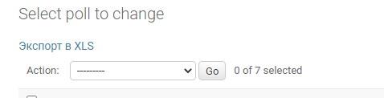
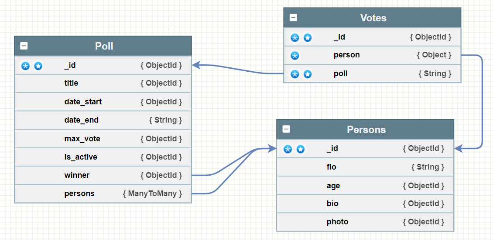

# **Приложение Голосование**

Проект выполнен на основе Django 4.04, django rest framework 3.13.1.
Для выгрузки результатов в xls и отправки письма на email использован Celery. 
В качестве БД используется SQLite.
Учетные данные импортируются из переменных окружения.

## Endpoints для работы с голосованиями:
   
* `api/v1/poll` - список всех голосований
* `api/v1/poll/<int:pk>`
* `api/v1/poll/active` - список активных голосований
* `api/v1/poll/finished` - список завершенных голосований
* `api/v1/add_vote` - проголосовать за кандидата (`{"person": <id_участника>, "poll": <id голосования>}`)
* `api/v1/poll/winner/<int:pk>` - получение победителя голосования по ID
* `api/v1/poll/members/<int:pk>` - получение участников голосования по ID


**Для запуска приложения:**

установить зависимости:
```bash
pip install -r requirements.txt
```

запустить Celery:

```bash
celery -A poll_app.celery worker --pool=solo -l info
```

запустить проект:
```bash
python manage.py runserver
```

Выгрузка результатов голосований в xls осуществляется кнопкой `Экспорт в xls` в панели администратора в модели Poll.



### Схема БД:
